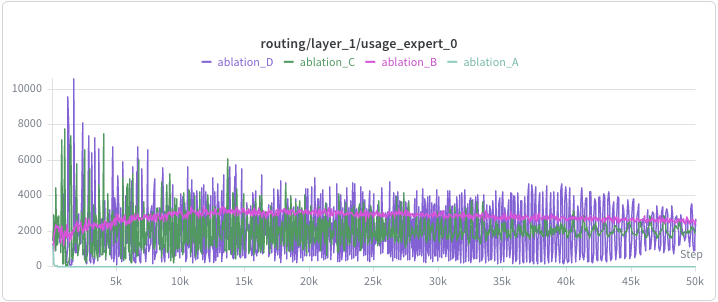
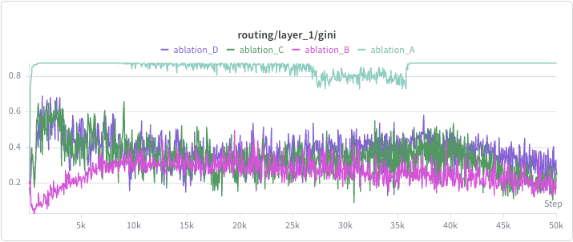
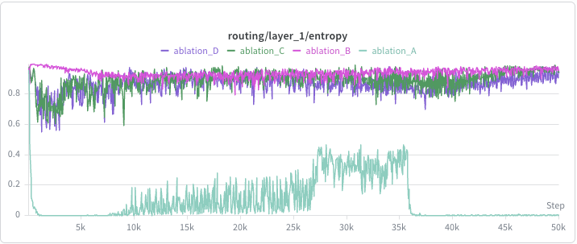

# Capacity-Priced MoE (CP-MoE)

Implementation and empirical validation of the **Capacity-Priced Mixture-of-Experts** routing framework. CP-MoE replaces fixed auxiliary loss coefficients with adaptive per-expert dual variables (λ) updated via tâtonnement, providing more stable load balancing with less hyperparameter tuning than standard approaches.

---

## Overview

Standard MoE load balancing uses a fixed coefficient α to penalize expert overload. CP-MoE instead formulates balancing as a constrained optimization problem:
$$min_θ  L_{LM}(θ)    \quad s.t. \quad   \mathbb{E}[usage_i(θ)] ≤ \alpha \cdot C_i   \forall i$$

The Lagrangian introduces per-expert dual variables λ_i, updated via tâtonnement after each optimizer step:
$$\lambda_i ← max(0, \lambda_i + η_{\lambda} · (usage_i - \alpha · C_i))$$

λ acts as an **integral controller** — accumulating excess demand over time — compared to the **proportional control** of fixed aux loss.

---

## Ablation Study

| ID | Name | Routing | Balancing |
|---|---|---|---|
| A | No Balancing | `top-k(r)` | None |
| B | Fixed Aux Loss | `top-k(r)` | GShard: fixed α |
| C | CP-MoE Loss Only | `top-k(r)` | Adaptive λ (loss term only) |
| D | CP-MoE Full | `top-k(r - λ)` | Adaptive λ (loss + routing offset) |

---

## Repository Structure
The repo structure mirrors MegatronLM's but highlights the main places where CP-MoE logic is implemented, including the price mechanism, routing adjustments, and training loop modifications for the primal-dual updates.
```
capacity-priced-moe/
├── megatron/
│   └──  transformer/
│      └──  moe/
│           ├── moe_layer.py
│           └── router.py          
└── pretrain_gpt.py     # used for training and ablation experiments
```
---

## Model

- 6 layers, 512 hidden dim, 8 experts, top-1 routing
- ~150M total parameters, ~40M activated per token
- Dataset: WikiText-103, GPT-2 tokenizer
- Training: 50k steps, batch 128, seq 512

---

## Key Design Decisions

**λ is external state, not a parameter.** Updated with `torch.no_grad()` after `optimizer.step()` to preserve the primal-dual update order.

**Loss surrogate uses pre-offset logits.** The balancing loss always uses `softmax(r)`, never `softmax(r - λ)`, to avoid double-counting λ's effect on the gradient.

**Routing offset (Ablation D only).** Subtracting λ from logits at dispatch time allows token-level heterogeneity: high-affinity tokens can still reach congested experts; marginal tokens are priced out.

---

## Metrics

| Metric | Target |
|---|---|
| `expert_gini` | Decreasing → balanced |
| `routing_entropy` | Increasing → uniform |
| `lambda_norm` | Plateaus → converged |
| `lm_loss` | Decreasing, comparable across ablations |

## Ablation Results

Results are collected across each layer and each expert, so the preliminary ablation results shown below are restricted to the first layer and first expert for clarity. The diagrams below represent the usage, the Gini Coefficient and the entropy for expert 0 at layer 1 across ablations.

<p align="center">
  
  
</p>
<p align="center">
  
</p>

It can be seen that the difference between ablation A and ablation B (using some balancing loss), results in more balanced expert usage, as expected. This is shown by a lower Gini and higher entropy for ablation B. Ablation C and D converge to similar behavior to Ablation B, with the routing offset in ablation D further improving balancing by allowing high-affinity tokens to still reach congested experts, resulting in faster convergence in gini and entropy to similar values as ablation B.

The next step is to analyze price / lambda convergence over rounds.